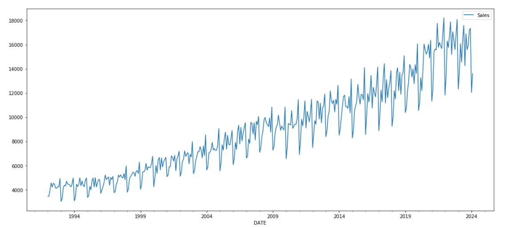
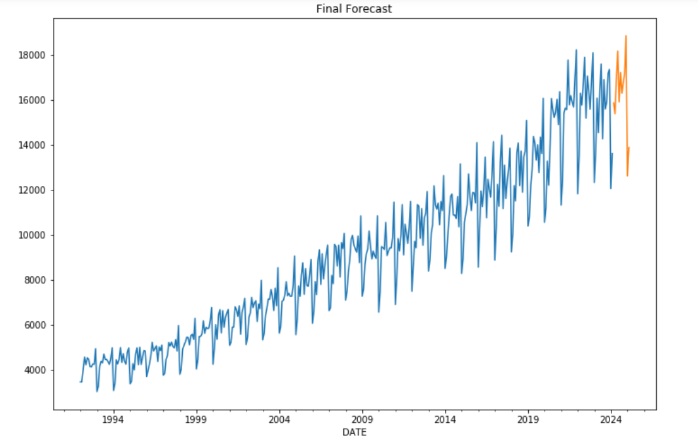

# Time-Series-Analysis-for-Sales

## Outline
- [ 1 - Packages](#1)
- [ 2 - Sales dataset](#2)
- [ 3 - Forecasting Method](#3)
    - [ 3.1 - Holt Winters Method](#3.1)
    - [ 3.2 - ARIMA Model](#3.2)
    - [ 3.3 - SARIMA Model](#3.3)
    - [ 3.4 - RNN Model](#3.4)
- [ 4 - Model Selection and Future Forecast](#4)

## Sales Data

## Components in Sales Data

## Forecast

